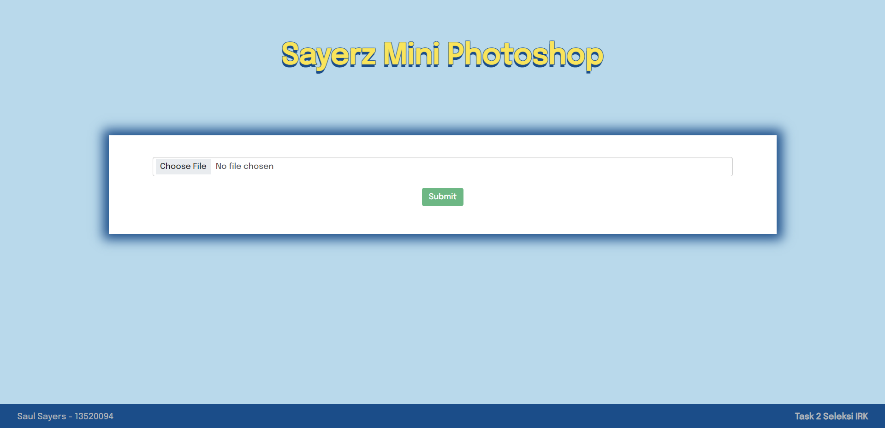
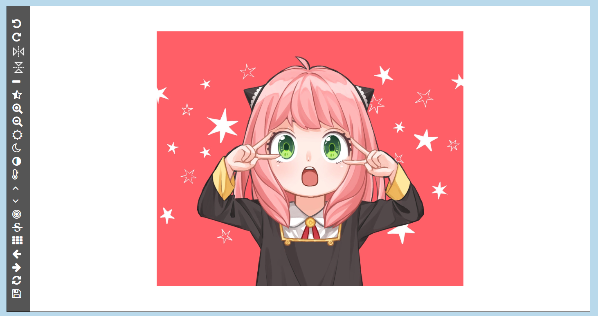

# Mini-Photoshop
> A website-based-app to edit photos using Python Flask as Backend

## Table of Contents

- [Mini-Photoshop](#mini-photoshop)
  - [Table of Contents](#table-of-contents)
  - [General Information](#general-information)
  - [Technologies Used](#technologies-used)
    - [Languages](#languages)
    - [Frameworks / Libraries](#frameworks--libraries)
  - [Features](#features)
  - [Screenshots](#screenshots)
  - [Requirements and Setup](#requirements-and-setup)
  - [How to Run](#how-to-run)
  - [References](#references)
  - [Contact](#contact)

## General Information

## Technologies Used

### Languages
- Python : Backend
- Javascript : Frontend

### Frameworks / Libraries
- Bootstrap : Untuk mempermudah desain web dengan memperoleh template komponen dengan cepat
- base64 : Untuk mempermudah melakukan encoding dan decoding dari sebuah url gambar menjadi string untuk dapat dikirim dari backend ke frontend
- PIL (Image) : Untuk membuka dan memproses gambar
- numpy : Untuk mengkonversi gambar menjadi sebuah matriks serta melakukan operasi matematika
- Flask : Untuk menjadikan python menjadi REST-api sehingga menjadi backend yang terpisah dengan frontend

## Features

## Screenshots



## Requirements and Setup
- Python 3 diperlukan dalam program ini. Anda bisa mendownloadnya pada link <a href="http://www.python.org/downloads/">berikut</a>, atau agar mempermudah anda dapat menonton proses instalasinya dari link <a href="https://www.youtube.com/watch?v=Kn1HF3oD19c">berikut</a>.

- pip harus terinstall. Anda bisa melakukan instalasi pada link <a href="https://pip.pypa.io/en/stable/installation/">berikut</a>. Pastikan juga pip harus ada pada PATH dengan cara <a href="https://www.youtube.com/watch?v=UTUlp6L2zkw">berikut</a>.

- Terdapat beberapa library yang harus terinstall untuk menjalankan program ini, yakni numpy, PIL Image, dan Flask. Anda bisa menggunakan pip yang sudah diinstall sebelumnya. Buka powershell atau terminal pada komputer anda, kemudian masukkan sintaks berikut: 
```
pip install numpy
pip install Flask
pip install PIL
```

- Clone repository ini ke dalam komputer anda dengan cara memasukkan sintaks berikut pada powershell atau terminal:
```
git clone https://github.com/saulsayerz/Mini-Photoshop
```

## How to Run
- Menjalankan backend dengan cara membuka terminal pada root repository yang sudah anda clone, kemudian cd ke src/backend. kemudian, masukkan sintaks berikut:
```
Flask run
```

- Menjalankan frontend dengan membuka terminal lain pada root repository, kemudian cd ke src/frontend. Kemudian, anda dapat membuat sebuah server http. Sebagai contoh, anda dapat memasukkan sintaks berikut:
```
python -m http.server 8000
```
- Website sudah bisa diakses melalui browser anda dengan link localhost:8000
- Silahkan upload gambar yang anda ingin edit pada box upload, kemudian klik tombol submit
- Box photoshop untuk mengedit foto akan terbuka, dan anda bisa melakukan fitur atau operasi edit yang tersedia pada sidebar (termasuk save)

## References :
- <a href="https://informatika.stei.itb.ac.id/~rinaldi.munir/Citra/2020-2021/05-Operasi-dasar-pengolahan-citra-2021.pdf">Milestone 1 dan Image Brightening</a>
- <a href="https://samirkhanal35.medium.com/contrast-stretching-f25e7c4e8e33">Contrast Stretching</a>
- <a href="https://informatika.stei.itb.ac.id/~rinaldi.munir/Citra/2019-2020/09-Image-Enhancement-Bagian1.pdf">Transformasi log dan pangkat</a>
- <a href="https://informatika.stei.itb.ac.id/~rinaldi.munir/Citra/2020-2021/10-Image-Enhancement-Bagian3-2021.pdf">Image Enchancement Bagian 3</a>
- <a href="https://www.pixelstech.net/article/1353768112-Gaussian-Blur-Algorithm#:~:text=Usually%2C%20image%20processing%20software%20will,Gaussian%20distribution%20to%20process%20images">Gaussian Blur Algorithm</a>
- <a href="https://stackoverflow.com/questions/4993082/how-can-i-sharpen-an-image-in-opencv">How to Sharpen Image in Python</a> 
- <a href="https://stackoverflow.com/questions/22937589/how-to-add-noise-gaussian-salt-and-pepper-etc-to-image-in-python-with-opencv">How to add Gaussian Noise in Python</a> 

## Contact :
> Saul Sayers (13520094), Informatika ITB 2020. 

More detailed contact: 
- Line : saulsayerz
- Instagram : <a href="https://www.instagram.com/saulsayers/?hl=en">saulsayers</a> 
- Linkedin : <a href="https://www.linkedin.com/in/saulsayers/?originalSubdomain=id">saulsayers</a>
- github : <a href="https://github.com/saulsayerz">saulsayerz</a>
- email : saulsayers@gmail.com
